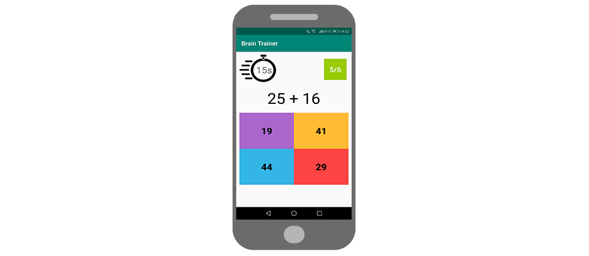

# Brain Trainer

Train your brain with this addition app. You've got 15 seconds to get as many answers right as you can. For every correct answer you will get 20 points, every wrong answer gets you -15 points. Try to beat the current high score!

## What I learned
- Using SharedPreferences to store and update the current high score 
- Java Backend for the game logic (creating some random calculations, implementing multiple choice, applying the score system etc.)
- Implementing a CountDownTimer to stop the time
- Structuring the multiple-choice button, using a GridLayout

## Usage
You can customize the game by changing the time, the point-scoring system (number of points for correct and wrong answers) and how big the calculation numbers can get (highest possible result). These variables can be found at the top of the MainActivity class.  
